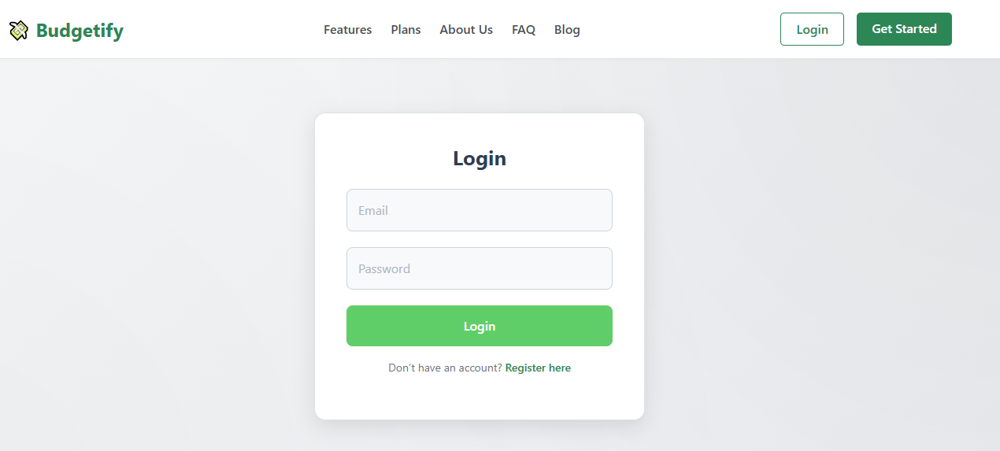
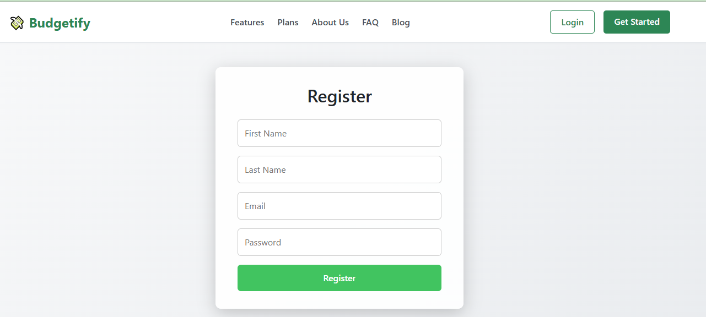
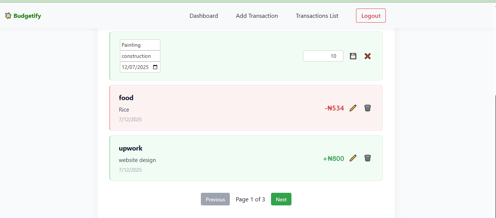
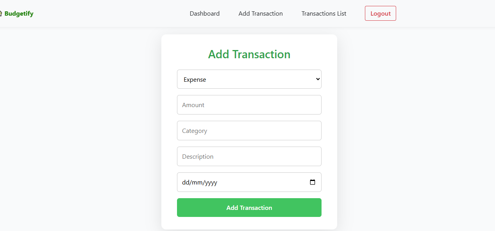

# 💸 Personal Finance Manager & Expense Tracker

A **full stack web application** to track income and expenses, visualize spending habits, and manage personal finances, built with **React, Node.js, Express, MongoDB** and enhanced with data visualization, export features, and clean responsive UI.

---

## ✨ **Features**

✅ User authentication (JWT): Register, login, logout  
✅ Add, edit & delete transactions (income or expense)  
✅ View recent transactions in a paginated, filterable, and sortable list  
✅ Dynamic pie chart summary: income vs expenses (Chart.js)  
✅ Category-based bar chart: auto-colored (green for income-heavy, red for expense-heavy categories)  
✅ Export transactions to CSV  
✅ Modern, clean and fully responsive design  
✅ Protected dashboard with welcome message & charts  
✅ Built as a portfolio-ready project with clear code organization and modular components

---

## 🛠 **Tech Stack**

| Layer     | Technologies                                                                 |
| --------- | ---------------------------------------------------------------------------- |
| Frontend  | React, Axios, React Router, Chart.js                                         |
| Backend   | Node.js, Express, JWT (JSON Web Tokens) for authentication                   |
| Database  | MongoDB + Mongoose                                                           |
| Styling   | Pure CSS (modular), global styles, responsive design                          |
| Extra     | CSV export, pagination, sort/filter logic                                     |

---

## 🚀 **Getting Started**

### 📦 Clone the project
```bash
git clone https://github.com/yourusername/personal-finance-tracker.git
cd personal-finance-tracker
⚙️ Install dependencies
bash
Copy
Edit
# Frontend
cd expense-tracker-frontend
npm install

# Backend
cd ../expense-tracker-backend
npm install
🧩 Configure environment
In /expense-tracker-backend, create a .env file:

env
Copy
Edit
MONGO_URI=your_mongodb_connection_string
JWT_SECRET=your_secret_key
PORT=5000
▶️ Start the app
bash
Copy
Edit
# Backend (runs on http://localhost:5000)
cd expense-tracker-backend
npm run dev

# Frontend (runs on http://localhost:3000)
cd ../expense-tracker-frontend
npm start
📊 Key Features & How They Work
Dashboard
Displays a friendly welcome message, a pie chart summarizing income vs expense, and a dynamic category bar chart.

Transaction List
Shows recent transactions, allows pagination, sorting by amount/date, and edit/delete per transaction.

Add Transaction
Add income or expense, specifying category, description, amount, and date.

Data Visualization

Pie chart: total income vs total expense.

Bar chart: category breakdown, automatically colors green (income) or red (expense).

Export
Export all transactions to CSV for backup or analysis.

Responsive & Clean UI
Designed to look great on desktop and mobile.

🧑‍💻 For Developers
Modular React components: Dashboard, TransactionList, CategoryChart

Backend REST API: CRUD endpoints for transactions & auth

JWT-based auth: secure protected routes

Global CSS styles to avoid conflicts and support responsiveness

Clear separation of frontend (expense-tracker-frontend) and backend (expense-tracker-backend)

📷 Screenshots
| Dashboard | Transaction List | Add Transaction | Landing Page | Login | Register|
| --------- | ---------------- | ---------------- |
|  |
|  |
|  |
|  |
|  |
|  | 
|  |
		

(Replace links with real screenshots)

📦 Folder Structure
plaintext
Copy
Edit
personal-finance-tracker/
├── expense-tracker-frontend/   # React frontend
│   ├── src/
│   │   ├── components/
│   │   ├── pages/
│   │   ├── api/axios.js
│   │   └── App.js
│   └── public/
├── expense-tracker-backend/    # Node.js + Express backend
│   ├── models/
│   ├── routes/
│   ├── controllers/
│   └── server.js
└── README.md
🌍 Live Demo (Optional)
Add your live deployed link here (Render, Vercel, Netlify)

🤝 Contributing
Contributions, issues and feature requests are welcome!
Feel free to fork, open issues, or submit pull requests.

⚖️ License
This project is licensed under the MIT License.

✏ Author
George Eze

[LinkedIn](https://www.linkedin.com/in/eze-george-a29b0021a/)

(Optional) Medium article  - coming soon

📌 Summary
A professional, full stack personal finance app demonstrating:

React frontend, Node.js/Express backend, MongoDB

Secure authentication, CRUD, pagination

Data visualization with Chart.js

Export features

Clean code & modern UX

Built as a complete portfolio project to showcase real-world skills. 🚀
